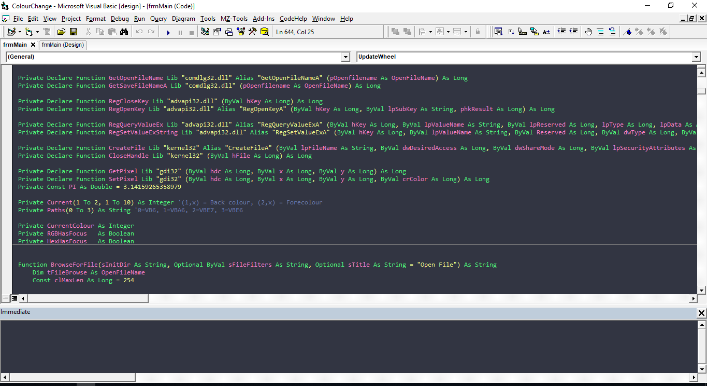

# Dracula for [Visual Basic 6](https://docs.microsoft.com/en-us/dotnet/visual-basic/)

> A dark theme for [Visual Basic 6](https://docs.microsoft.com/en-us/dotnet/visual-basic/)

## Install

All instructions can be found at [draculatheme.com/visual-basic-6](https://draculatheme.com/visual-basic-6).

## Community

* [Twitter](https://twitter.com/draculatheme) - Best for getting updates about themes and new stuff.
* [GitHub](https://github.com/dracula/dracula-theme/discussions) - Best for asking questions and discussing issues.
* [Discord](https://draculatheme.com/discord-invite) - Best for hanging out with the community.

## Team

This theme is maintained by the following person(s) and a bunch of [awesome contributors](https://github.com/dracula/visual-basic-6/graphs/contributors).

 |
--- |
[Jean Andreatta](https://github.com/jecsatta) |

## License

[MIT License](./LICENSE)